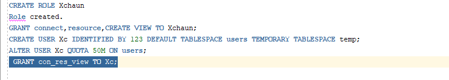
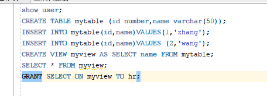

# test2
1 以system登录到pdborcl，创建角色Xchaun和用户Xc，并授权和分配空间 
实验代码 
CREATE ROLE Xchaun; 
GRANT connect,resource,CREATE VIEW TO Xchaun; 
CREATE USER Xc IDENTIFIED BY 123 DEFAULT TABLESPACE users TEMPORARY TABLESPACE temp; 
ALTER USER Xc QUOTA 50M ON users; 
如图 
  
结果如图： 
  
2新用户Xc连接到pdborcl，创建表mytable和视图myview，插入数据，最后将myview的SELECT对象权限授予hr用户。  
实验代码如图： 
  
结果如图： 
  
