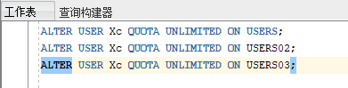
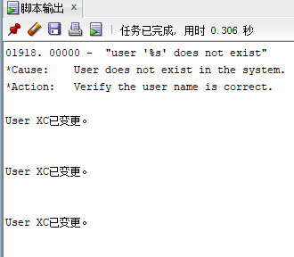
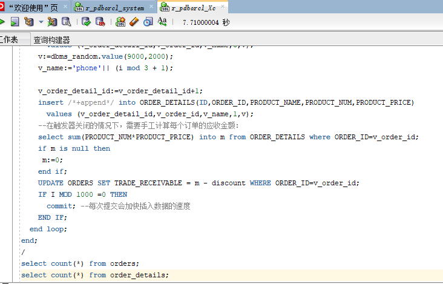
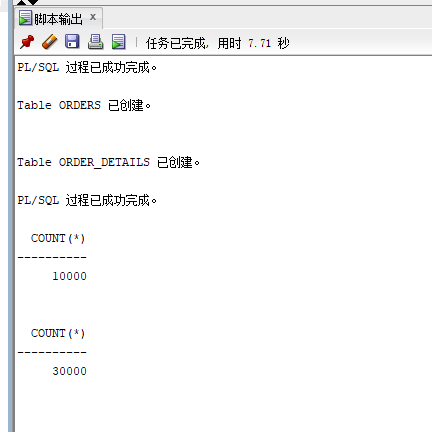
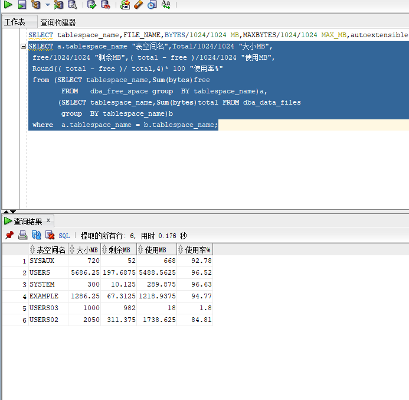

# test3
1.使用你自己的账号创建本实验的表，表创建在上述3个分区，自定义分区策略。
你需要使用system用户给你自己的账号分配上述分区的使用权限。你需要使用system用户给你的用户分配可以查询执行计划的权限。
 
如图：
 
  
  
2.表创建成功后，插入数据，数据能并平均分布到各个分区。每个表的数据都应该大于1万行，对表进行联合查询。 
  
结果如图： 
  
  
查看表空间的数据库文件，以及每个文件的磁盘占用情况。  
结果如图：  
  