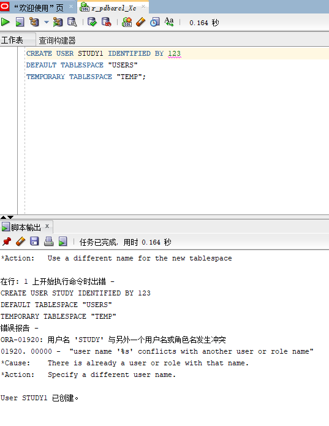
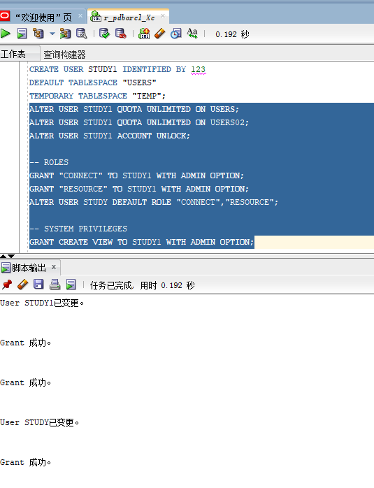
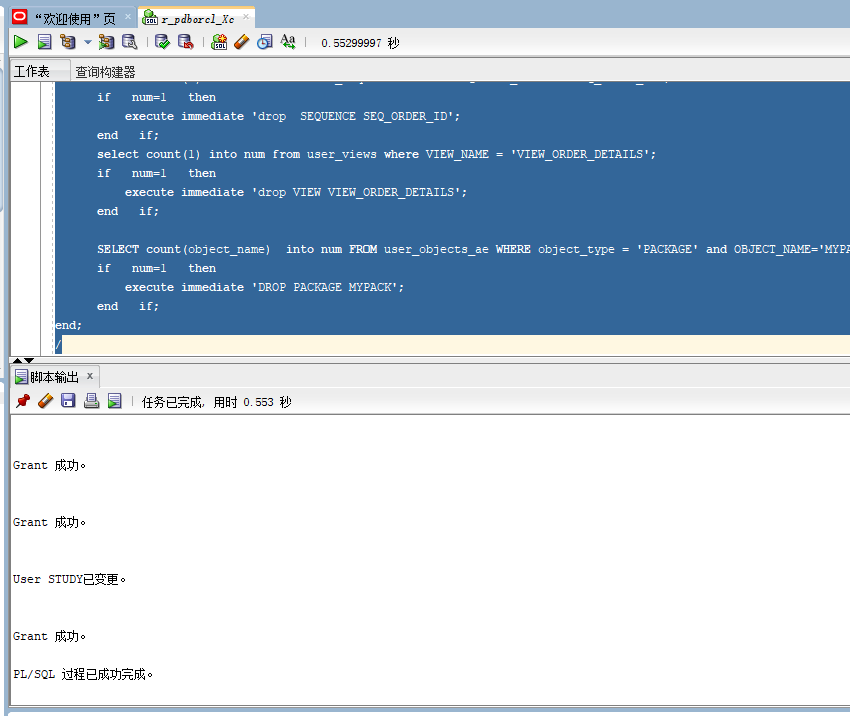
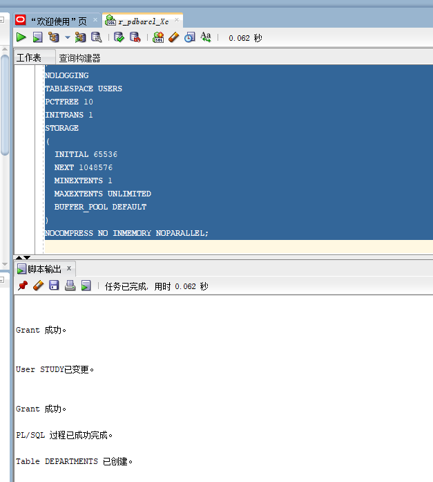
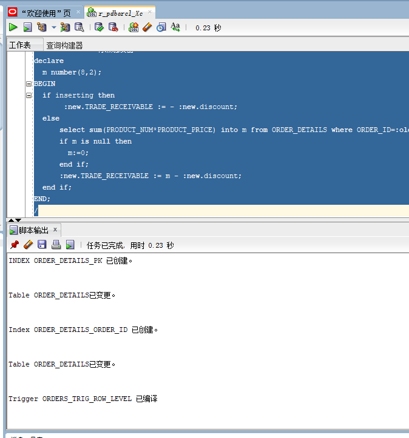
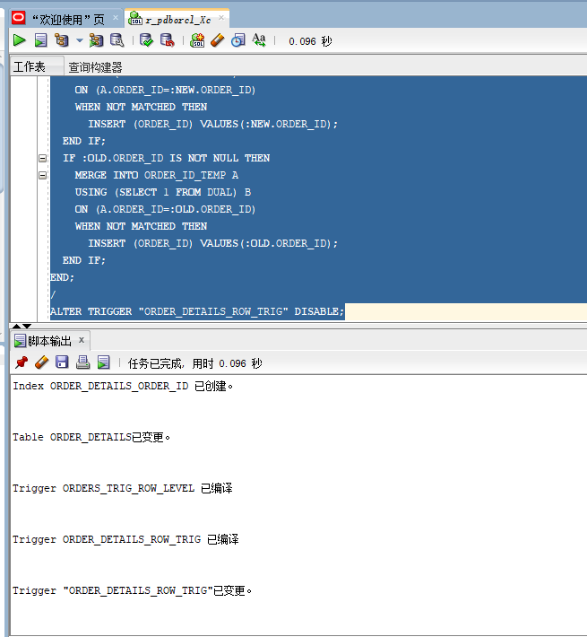
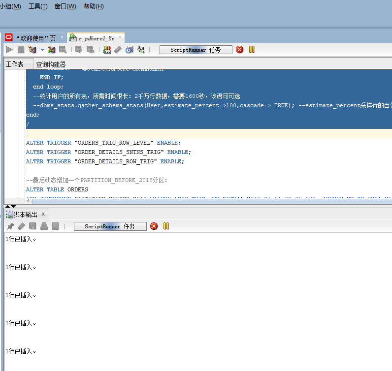
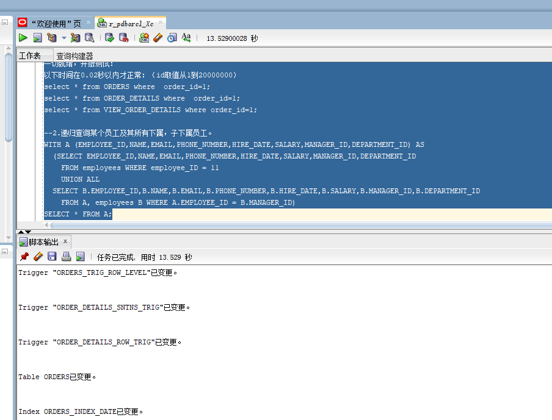
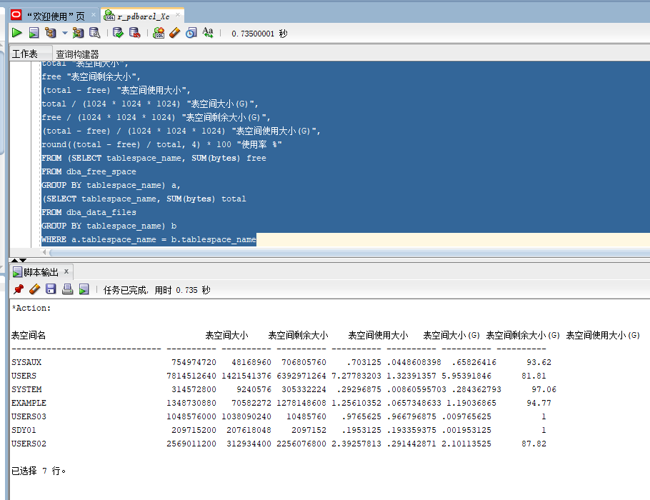

# test4
1.创建用户study1 
如图： 
  
ALTER USER STUDY QUOTA UNLIMITED ON USERS; 
ALTER USER STUDY QUOTA UNLIMITED ON USERS02; 
ALTER USER STUDY ACCOUNT UNLOCK; 

-- ROLES 
GRANT "CONNECT" TO STUDY WITH ADMIN OPTION; 
GRANT "RESOURCE" TO STUDY WITH ADMIN OPTION; 
ALTER USER STUDY DEFAULT ROLE "CONNECT","RESOURCE"; 

-- SYSTEM PRIVILEGES 
GRANT CREATE VIEW TO STUDY WITH ADMIN OPTION; 
如图： 
  
--删除表和序列
--删除表的同时会一起删除主外键、触发器、程序包。 
如图： 
  
--  DDL for Table DEPARTMENTS 
如图：
  
-创建3个触发器 
如图：
  
--  DDL for Trigger ORDER_DETAILS_ROW_TRIG 
如图：  
--插入DEPARTMENTS，EMPLOYEES数据 
如图：  
递归查询某个员工及其所有下属，子下属员工。 
如图：  
--查看数据文件的使用情况 
如图：  